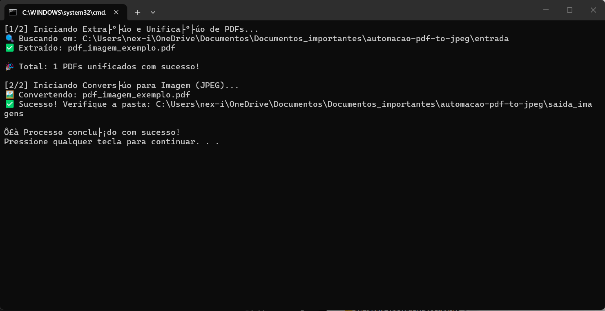

Automação de Extração e Conversão de Documentos (PDF para JPEG)
Descrição:
Este projeto foi criado para resolver um gargalo logístico no processamento de relatórios. Ele automatiza a coleta de arquivos PDF espalhados por diversas subpastas e realiza a conversão em massa para imagens JPEG, facilitando a visualização rápida e o arquivamento padronizado.

Funcionalidades:
Varredura Recursiva: O script navega por toda a árvore de diretórios a partir de uma pasta "mãe".

Unificação Inteligente: Copia todos os PDFs para uma pasta central, renomeando-os com o nome da pasta de origem para evitar duplicatas e manter a rastreabilidade.

Conversão de Alta Qualidade: Transforma cada página dos PDFs em arquivos .jpg individuais usando o motor Poppler.

Tratamento de Erros: Sistema de log simples que informa no console o sucesso ou falha de cada arquivo processado.

Tecnologias e Bibliotecas:
Python 3.13

pdf2image: Para a interface com o Poppler e extração das páginas.

Pillow (PIL): Para o processamento e salvamento das imagens.

OS & Shutil: Para manipulação avançada de arquivos e diretórios.

Como executar:

1. Pré-requisitos
Além do Python, você precisará do Poppler instalado no seu sistema.
https://github.com/oschwartz10612/poppler-windows/releases/

2. Instalação
Clone o repositório e instale as dependências:

git clone https://github.com/seu-usuario/automacao-pdf-to-jpeg.git
cd automacao-pdf-to-jpeg
pip install -r requirements.txt

3. Uso
Coloque suas pastas com PDFs dentro do diretório /entrada.
Execute o arquivo de automação:
EXECUTAR_TUDO.bat

Ou execute manualmente via terminal:

python src/extrair_pdfs.py
python src/pdf_to_jpeg.py

Estrutura do Projeto:
Plaintext
├── src/
│   ├── extrair_pdfs.py    # Lógica de unificação de arquivos
│   └── pdf_to_jpeg.py     # Lógica de conversão para imagem
├── entrada/               # Pasta de input (não versionada)
├── saida_pdfs/            # PDFs centralizados
├── saida_imagens/         # JPEGs finais gerados
└── EXECUTAR_TUDO.bat      # Script de execução rápida no Windows

Demonstração da automação funcionando:

Autora:

Silvana Cabral - www.linkedin.com/in/silvana-cabral
